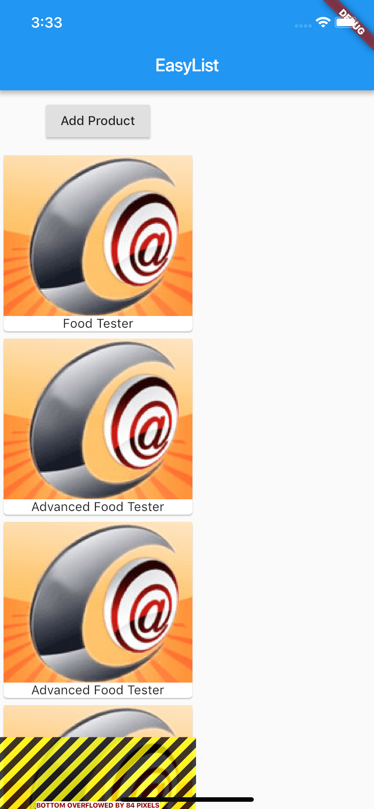

# Flutter101
Flutter101

Mobile developers should pay much attention to flutter in 2019, well, this Project is for Flutter learning from zero. Every commit is base on milestone which means it can run exactly. so if you are also interested in Flutter, you can download and review this easy code based on commits.

I will commit code continuously, but learning guide such as README cannot be promised.

My hobbies:

 - when I name a class name or class file name, I prefer Pascal Case, you can call it Upper Camel Case, rather than Under Score Case.
 
## Notes



Flutter | iOS
-------------|-------------
widget | object
widget build| object load
StatelessWidget/State build() | object load
StatefulWidget  createState() | UIViewController loadView
StatelessWidget vs StatefulWidget  |  ✅`NSObject vs UIViewController` or ❌`NSObject/UIView vs UIControl`
StatefulWidget vs  State | UIViewController vs UIView
StatefulWidget.createState and State.initState vs State.setState | ✅`loadView vs (layoutSubviews->viewWillLayoutSubviews)` or ❌ `object.alloc vs UIViewController.viewDidLoad`
Column | CollectView/TableView/StackView
Column(children:[]) | TableView.cell
List | Array
List.map((element) => Card()).toList() | Array.`enumObject` then `addObject`

this.startingProduct vs widget.startingProduct


Objective-C 

 ```Objective-C
button.edgeInsets
 ```

VS

Flutter

 ```Flutter
Container(
          margin: EdgeInsets.all(10.0),
          child: RaisedButton(...)
          );
 ```

          

Objective-C

 ```Objective-C
- (void)viewDidLoad {
    [super viewDidLoad];
    //TODO:  
}
 ```
 
  VS
  
  Flutter
  
 ```Flutter
class _ProductManagerState extends State<ProductManager> {
  @override
    void initState() {
      //TODO:  
      super.initState();
    }
}
 ```


 


